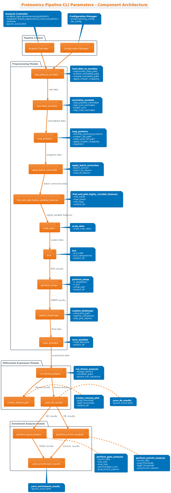

Pipeline Overview
=================

Visual flowcharts showing the workflow and key parameters for both analysis pipelines.

RNA-seq Pipeline
---------------

The RNA-seq pipeline processes featureCounts data through quality control, normalization, differential expression analysis using DESeq2, and functional enrichment.

TMT Proteomics Pipeline
----------------------

The TMT pipeline analyzes protein expression data with advanced normalization options, batch correction, differential expression using Limma, and pathway analysis.

Key Differences
--------------

.. list-table::
   :header-rows: 1
   :widths: 40 30 30

   * - Feature
     - RNA-seq
     - TMT Proteomics
   * - Input Data
     - featureCounts files
     - Protein expression matrix
   * - Statistical Method
     - DESeq2
     - Limma
   * - Batch Correction
     - Not available
     - Combat integration
   * - Normalization
     - TPM-, Sum- normalizations
     - Sum-, Peptide-, MAD- normalizations